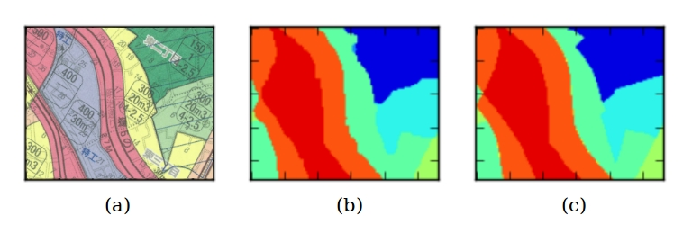

# AI Cloud for Computer Vision
The application of validated images based on Deep Learning
## Map segmentation and Denoising

Semantic segmentation for urban planning maps based on Deep Learning. (a) Urban planning map. (b) Semantic segmentation result by optimized Deep Learning framework. (c) Denoised Result
